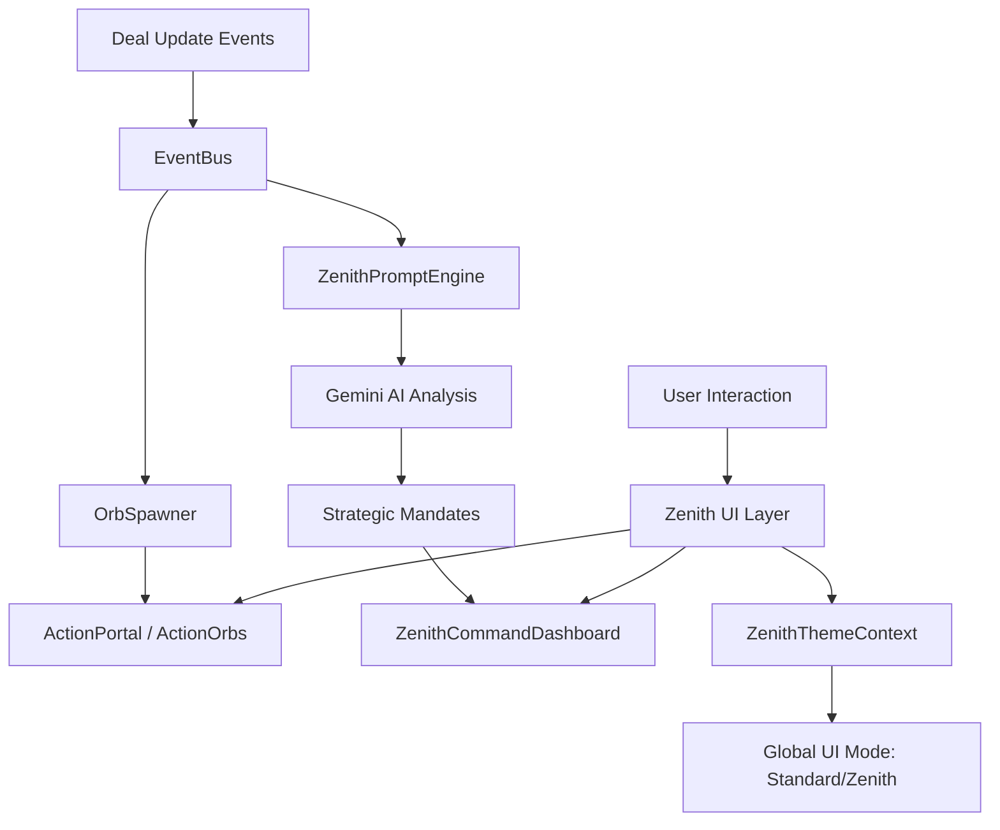

# Feature: Zenith Ultimate Orchestrator (ZUO) - The World-Class Business Command Center

## Architecture Overview

## System Architecture Changes
- **Adaptive UI Layer:** Implement a global `ZenithProvider` or CSS variable set that can togglebetween standard and Zenith (Hyper-Premium) modes.
- **Event-Driven AI Integration:** Enhance the AI engine to listen for specific deal velocity changes and trigger proactive "Strategic Mandates" in the Command Center.
- **Notification Bus:** A new non-blocking notification system for "Actionable Orbs" that live outside the standard dashboard flow.
- **Design System Evolution:** Transition from "Claymorphism" to a "Cyber-Glassmorphism" design system using `backdrop-filter: blur()`, `mask-image` for borders, and high-contrast gold/neon accents.

## Data Models/Schema Changes
- **`deals` table enrichment:** Add `sentiment_score` (float) and `velocity_index` (float) fields to track deal health over time.
- **`notifications` table (New):** To store actionable events that haven't been resolved yet (e.g., `id`, `type`, `payload`, `status: pending|resolved`, `urgency: 1-5`).
- **`team_members` table enhancement:** Add `specialization` and `performance_multiplier` for more accurate AI forecasting.

## API Endpoints or Interfaces
- **AI Strategy Generator:** `generateStrategicMandates(currentDeals)` - A specialized Gemini prompt to analyze the entire pipeline and return 3 high-level business actions.
- **Sentiment Analyzer:** `analyzeDealSentiment(dealNotes)` - AI utility to score the emotional tone of a deal's history.
- **Notification Resolver:** `resolveActionOrb(notificationId, action)` - Logic to execute tasks directly from a notification.

## Components to Create/Modify
- **Create:** 
  - `ZenithCommandDashboard`: A fullscreen, "Command Center" style view with a deep obsidian/starfield background and glass widgets.
  - `ActionOrb`: A floating, spherical notification component with SVG morphing animations.
  - `GlassCard`: A reusable layout component with `backdrop-blur-md` and "Glowing Border" effects.
  - `StrategicMandateCard`: A high-impact card showing AI-driven business advice with "Execute" buttons.
  - `PerformanceGuage`: A custom SVG-based circular progress indicator with neon gradients.
- **Modify:**
  - `App.jsx`: Add high-level layout wrappers for Zenith Mode.
  - `Button.jsx`: Update to support "Zenith Style" (Gold-foiled, glowing, or glass variants).
  - `CommandCenter.jsx`: Refactor to use the new Zenith design components.

## Key Design Decisions
- **Obsidian & Gold Color Palette:** Use hex `#0B0E14` (Deep Space) for backgrounds and `#D4AF37` (Metallic Gold) for success/premium highlights.
- **Zero-Friction Navigation:** Implement "Quick Hub" (Command + K) for rapid searching and task execution.
- **High-End Motion:** Use `framer-motion` for all layout transitions to ensure a "luxury car" level of smoothness.
- **Visual Urgency:** Contrast low-priority items with low opacity and high-priority items with "Neon Pulse" (shadow animations).

## Security and Performance Considerations
- **Optimized Blur Effects:** `backdrop-filter` can be resource-intensive. Limit its use to primary overlay elements and use standard semi-transparent backgrounds for minor items.
- **AI Rate Limiting:** Strategic snapshots are generated once per hour or upon significant deal changes to preserve API tokens and performance.
- **Mobile-First Glassmorphism:** Ensure glass effects degrade gracefully on lower-end mobile devices (e.g., fall back to solid colors).
